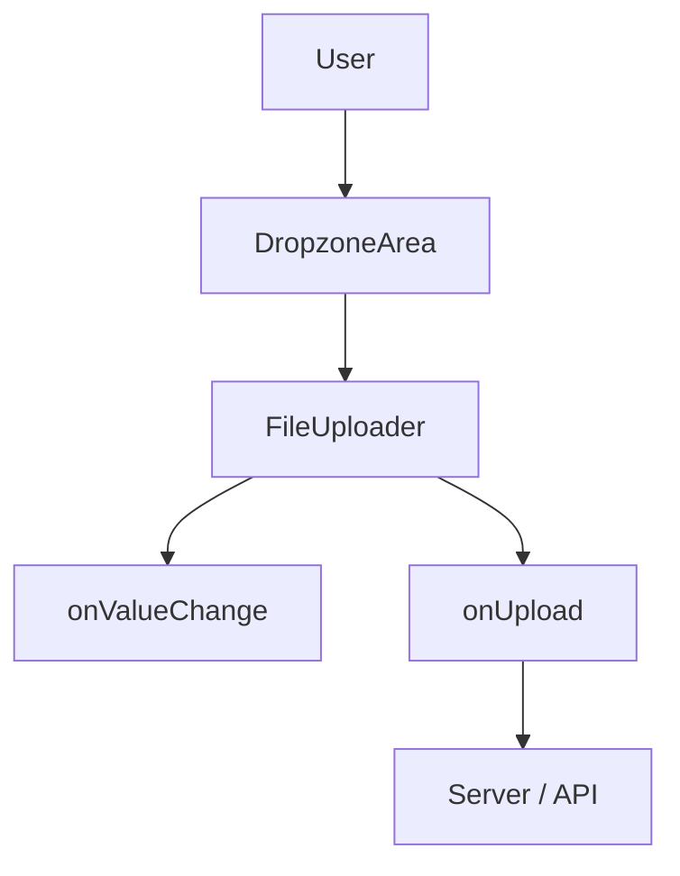

<ComponentTabs name='file-uploader-basic' />

## Installation

<ShadcnTabs defaultValue="cli">
  <TabsList>
    <TabsTrigger value="cli">CLI</TabsTrigger>
    <TabsTrigger value="manual">Manual</TabsTrigger>
  </TabsList>

  <TabsContent value="cli">
    <Tabs items={["npm", "pnpm", "yarn", "bun"]}>
      <Tab value="npm">
        ```bash
        npx shadcn@latest add 'https://combillui.vercel.app/registry/file-uploader.json'
        ```
      </Tab>

      <Tab value="pnpm">
        ```bash
        pnpm dlx shadcn@latest add 'https://combillui.vercel.app/registry/file-uploader.json'
        ```
      </Tab>

      <Tab value="yarn">
        ```bash
        npx dlx shadcn@latest add 'https://combillui.vercel.app/registry/file-uploader.json'
        ```
      </Tab>

      <Tab value="bun">
        ```bash
        bunx --bun shadcn@latest add 'https://combillui.vercel.app/registry/file-uploader.json'
        ```
      </Tab>
    </Tabs>
  </TabsContent>

  <TabsContent value="manual">
    <Steps>
      <Step>
        Install dependencies

        ```bash
        npm install react-dropzone sonner lucide-react
        ```

        And make sure you have these Shadcn UI components:

        ```bash
        npx shadcn@latest add button progress scroll-area
        ```
      </Step>

      <Step>
        Copy the `FileUploader` implementation from the registry into your project:

        ```tsx
        <ComponentSource name="file-uploader" />
        ```
      </Step>
    </Steps>
  </TabsContent>
</ShadcnTabs>

## Usage

```tsx
import { FileUploader } from "@/components/blocks/file-uploader";

export function Example() {
  async function onUpload(files: File[]) {
    // Call your API / storage service here
    await Promise.all(
      files.map(async (file) => {
        // uploadFile(file)
      }),
    );
  }

  return (
    <FileUploader
      accept={{ "image/*": [] }}
      maxFileCount={1}
      maxSize={2 * 1024 * 1024}
      onUpload={onUpload}
    />
  );
}
```

## Examples

### Basic Upload

Single-image upload with async `onUpload`.

<ComponentTabs name='file-uploader-basic' />

### Multiple Files

Controlled mode with multiple files and max file count.

<ComponentTabs name='file-uploader-multiple' />

### With Progress

Simulated async uploads with per-file progress.

<ComponentTabs name='file-uploader-with-progress' />

## Props

The `FileUploader` component accepts the following props:

| Prop           | Type                                   | Default                | Description                                   |
| -------------- | -------------------------------------- | ---------------------- | --------------------------------------------- |
| `value`        | `File[]`                               | `undefined`            | Controlled list of selected files             |
| `onValueChange`| `(files: File[]) => void`              | `undefined`            | Called when selected files change             |
| `onUpload`     | `(files: File[]) => Promise<void>`     | `undefined`            | Async upload handler                          |
| `progresses`   | `Record<string, number>`               | `undefined`            | Map of file name to upload progress (0-100)   |
| `accept`       | `DropzoneProps["accept"]`              | `{ "image/*": [] }`    | Accepted mime types / extensions              |
| `maxSize`      | `DropzoneProps["maxSize"]`             | `2 * 1024 * 1024`      | Maximum file size in bytes                    |
| `maxFileCount` | `DropzoneProps["maxFiles"]`            | `1`                    | Maximum number of files                       |
| `multiple`     | `boolean`                              | `false`                | Allow selecting multiple files                |
| `disabled`     | `boolean`                              | `false`                | Disable the uploader                          |
| `...divProps`  | `React.HTMLAttributes<HTMLDivElement>` | -                      | Additional wrapper `div` props                |

## Behavior & UX

- Enforces both **file count** and **file size** limits via `maxFileCount` and `maxSize`.
- Uses `react-dropzone` for drag & drop + click-to-select behavior.
- When `onUpload` is provided:
  - Automatically wraps the promise with `toast.promise` from `sonner`.
  - Shows loading/success/error toasts.
  - Clears the local file list after successful upload.
- When `onUpload` is not provided:
  - The component acts as a pure file picker.
  - Manage selected files via `value` / `onValueChange`.
- Previews image files using a thumbnail, falls back to an icon for other types.

## Accessibility

- The clickable dropzone area is keyboard-focusable with visible focus ring.
- `sr-only` text on the remove button improves screen reader experience.
- Uses clear status text in toasts for upload results.

## Flow Diagram



